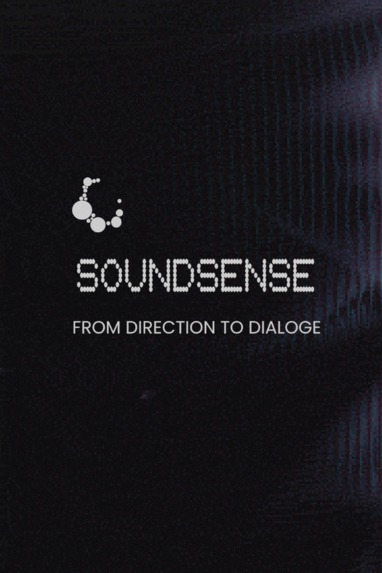
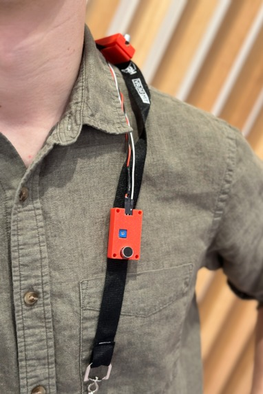
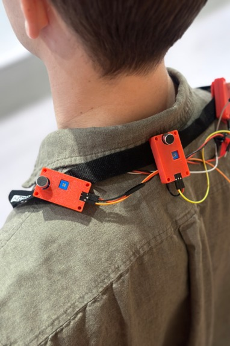
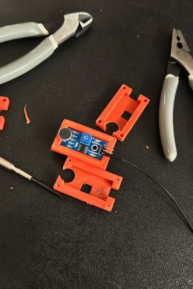
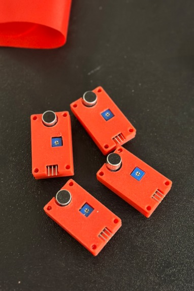
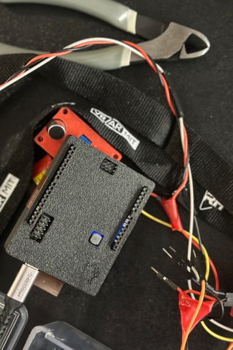
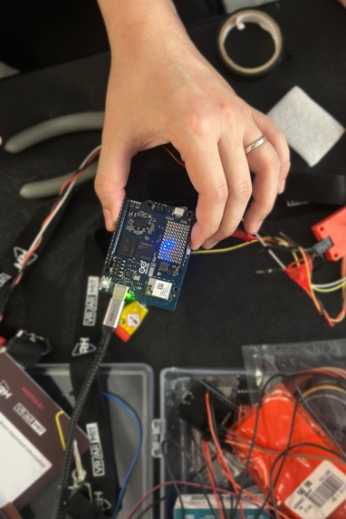
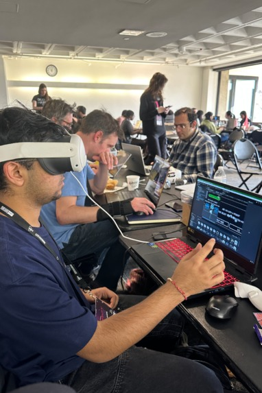

# SoundSense
SoundSense — MIT Reality Hack 2026  
Winners: Qualcomm Best Use of Edge AI for Hardware Hack

Devpost:
```
https://devpost.com/software/soundsense-tfqiv9
```

SoundSense is a real-time audio captioning system for AR that fuses:
- **Direction sensing** from a 4-mic Arduino array
- **USB mic capture + VAD**
- **Speech-to-text (ElevenLabs)**
- **Sound event classification** (placeholder MediaPipe pipeline)
- **TCP streaming** to Unity or other clients

## Media

Main video: https://vimeo.com/1158210043?fl=pl&fe=vl




## Inspiration

SoundSense is inspired by biomimicry, drawing from how barn owls construct a precise 3D spatial map of sound to navigate in complete darkness. Rather than simply relying on sound, owls understand where sound exists in space. SoundSense adopts this strategy, translating sound into spatial information. By visualizing spoken language as spatial cues and speech translation, the tool reframes communication as a multisensory experience, creating more inclusive systems for individuals often excluded from audio-dependent interactions.

## What It Does

SoundSense provides directional audio and speech awareness to users with hearing impairments:
- The acoustic sensor array detects noise and voice activity relative to the user.
- The Arduino Uno Q publishes sensor data to the Linux MPU, which forwards it over TCP.
- Captions and direction of sound amplitude are displayed to the user in AR.





## Repo Layout

```
Arduino/
  sketch/                # MCU firmware (direction events via RouterBridge)
  python/main.py         # UNO Q Linux-side TCP server + rebroadcast
  bridge_mic/            # Experimental ESP32 I2S mic bridge
ElevenLabs/
  backend/               # Python backend (audio, VAD, STT, classifier, TCP client)
  requirements.txt
  README.md              # Detailed backend setup & troubleshooting
Unity/                   # Unity client project (not included here)
Design/                  # Design artifacts
debug_audio/             # Saved audio chunks when enabled
```

## Architecture (At a Glance)

1. **Arduino MCU** reads 4 analog amplitude sensors (A0–A3) and sends direction events.
2. **UNO Q Linux** runs `Arduino/python/main.py`, a TCP server that rebroadcasts framed messages to clients.
3. **Python backend** (`ElevenLabs/backend/main.py`) captures audio, runs VAD, performs STT (ElevenLabs API), gates by direction/energy, and sends captions to the TCP server.
4. **Unity client** connects to the TCP server and renders captions (client not included in this repo).

## Quick Start (Local Dev)

### 1) Python backend

```bash
cd ElevenLabs
python3 -m venv venv
source venv/bin/activate
pip install -r requirements.txt

export ELEVENLABS_API_KEY="your_key_here"
python backend/main.py
```

### 2) UNO Q TCP server

```bash
python Arduino/python/main.py
```

### 3) Arduino firmware

Open `Arduino/sketch/sketch.ino` in Arduino IDE and upload to your board.  
Connect 4 analog amplitude sensors to `A0–A3`.

## How We Built It (Devpost Summary)

- Built an acoustic array of sound sensors (we used KY-037).
- Connected sensors to Arduino Uno Q.
- Used DirectBridge to publish MCU sensor data to the Debian MPU over a socket (`https://github.com/ramalamadingdong/bridge_direct`).
- Ran speech-to-text on the Debian side (Whisper.cpp was the local option; ElevenLabs API was used for higher quality transcription in this repo) (`https://github.com/ggml-org/whisper.cpp`).
- Captured audio from an external USB mic and built WAV segments for transcription.
- Sent caption payloads over TCP to a Unity AR client.
- Rendered direction cues and caption boxes in AR.

Note: Some on-device code used during the hackathon may not be included in this repo.





## Steps to Replicate (High Level)

- Build an acoustic array of sound sensors or microphones.
- Connect sensors to Arduino Uno Q and publish sensor data from MCU to the Linux MPU.
- Run speech-to-text locally (Whisper.cpp) or via API (ElevenLabs) on the Debian side.
- Encode captions into TCP frames and stream to the Unity AR client.
- Render direction cues (e.g., edge gradients) and caption boxes in AR.

## Configuration

All runtime options are environment variables defined in `ElevenLabs/backend/config.py`:
- `ELEVENLABS_API_KEY` (required)
- Serial direction gating: `ENABLE_SERIAL`, `SERIAL_PORT`
- Audio/VAD: `VAD_START_THRESHOLD`, `VAD_STOP_THRESHOLD`, `MAX_SPEECH_SECONDS`
- TCP: `TCP_HOST`, `TCP_PORT`, `TCP_MESSAGE_FORMAT`
- Debug audio capture: `SAVE_AUDIO_DIR`, `SAVE_AUDIO_MAX`

See `ElevenLabs/README.md` for a full setup guide and troubleshooting.

## Notes

- The MediaPipe sound classifier is a placeholder (`ElevenLabs/backend/classifier_mediapipe.py`).
- `debug_audio/` holds captured WAV snippets when `SAVE_AUDIO_DIR` is set.
- The Unity client is not checked into this repo; only the TCP protocol is defined here.

## Testing + Demos





## Challenges

- Arduino App Lab runs apps in a Docker container and doesn’t expose the compose file, making it hard to add a local model.
- We used DirectBridge to create a socket between MCU and MPU to pass sensor data into the Linux-side model.

## Accomplishments

- Rapid prototyping of an assistive device for people with hearing impairment.
- Ergonomic design integrating sensors into daily life.

## What We Learned

- Remote embedded development over SSH.
- Building and running local speech-to-text models.
- Managing Python dependencies with virtual environments.

## What’s Next

- Replace sound sensors with higher-quality microphones.
- Add more sensors for better direction precision.
- Incorporate user feedback to improve comfort and effectiveness.

## Build Process


## Built With

- arduino
- elevenlabs
- qualcomm
- unity
- whisper.cpp

## Team


